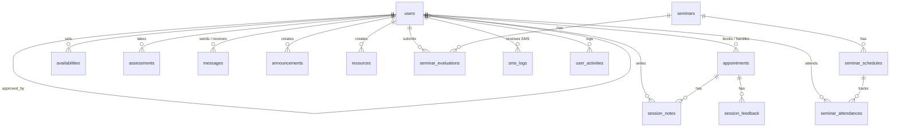
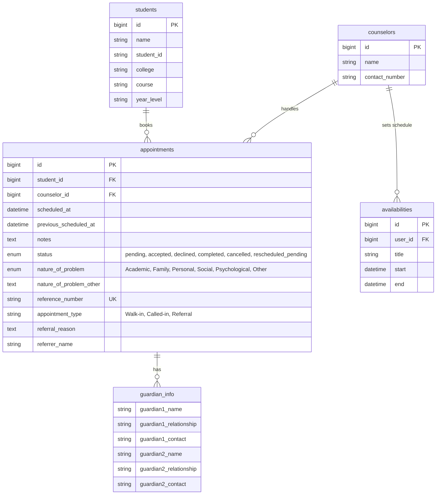
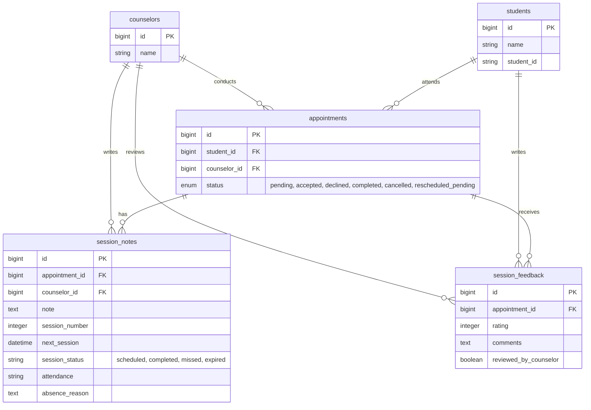
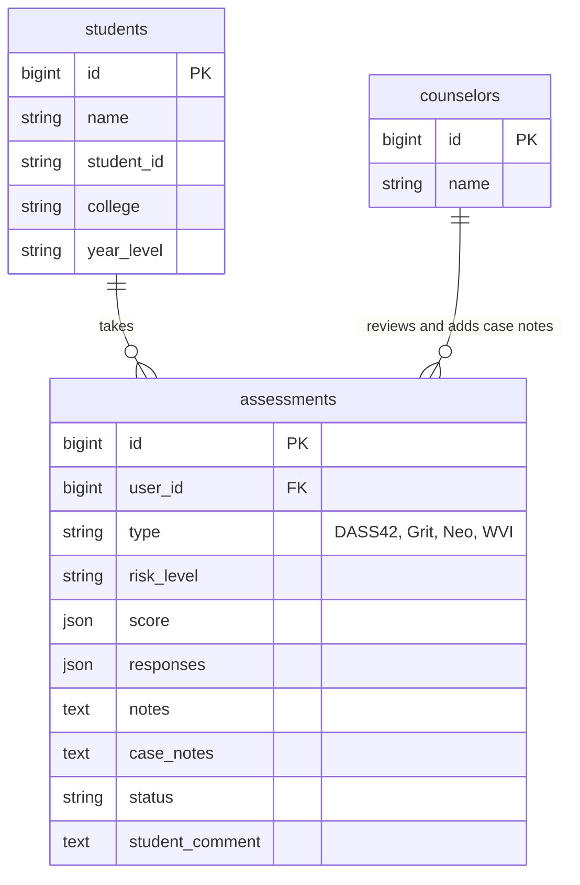
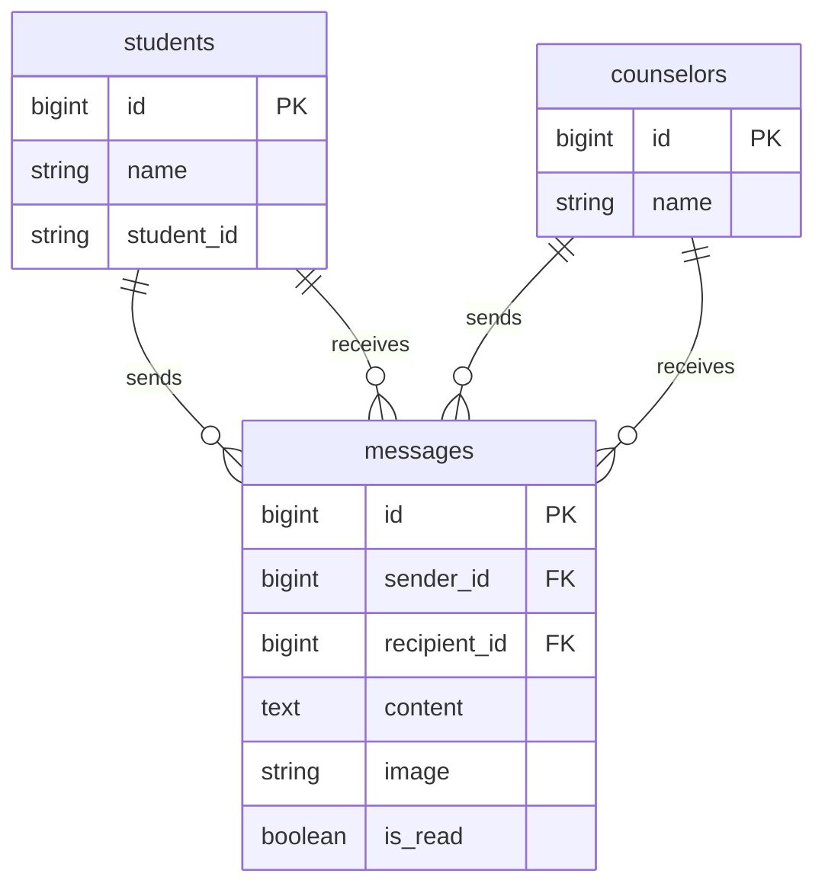
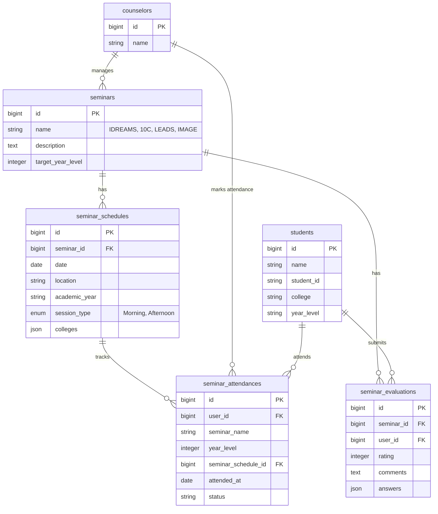
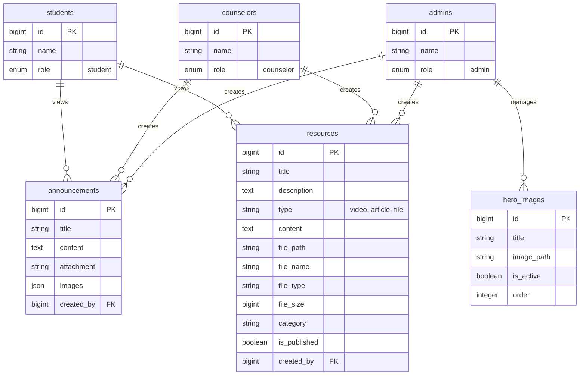
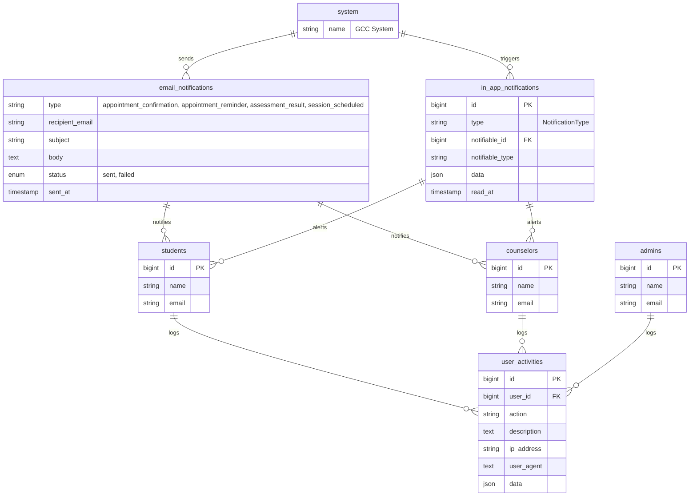

# GCC System — Entity Relationship Diagram

> **Note:** All tables include `created_at` and `updated_at` timestamp columns (omitted from diagrams for brevity).

---

## High-Level Overview

This diagram shows **all entities and their relationships** at a glance — no column details.

---

## 1. User Management & Authentication

> **Note:** The system uses a single `users` table with a `role` column. The entities below are shown **separated by role** to visualize the distinct connections each role has.

```mermaid
erDiagram
    users ||--|| admins : "role = admin"
    users ||--|| students : "role = student"
    users ||--|| counselors : "role = counselor"

    admins ||--o{ users : "approves registration"
    admins ||--o{ announcements : "creates"
    admins ||--o{ resources : "creates"
    admins ||--o{ user_activities : "logs"

    students ||--o{ appointments : "books"
    students ||--o{ assessments : "takes"
    students ||--o{ messages : "sends / receives"
    students ||--o{ seminar_attendances : "attends"
    students ||--o{ seminar_evaluations : "submits"

    counselors ||--o{ appointments : "handles"
    counselors ||--o{ session_notes : "writes"
    counselors ||--o{ availabilities : "sets schedule"
    counselors ||--o{ messages : "sends / receives"
    counselors ||--o{ resources : "creates"
    
    users {
        bigint id PK
        string name
        string email UK
        timestamp email_verified_at
        string password
        enum role "admin, student, counselor"
        boolean is_active
        string remember_token
        boolean two_factor_enabled
        string avatar
        string registration_status "pending, approved, rejected"
        text registration_notes
        bigint approved_by FK
        timestamp approved_at
        text rejection_reason
        boolean consent_agreed
        timestamp consent_agreed_at
        string passkey
    }

    admins {
        bigint user_id FK
        string name
        enum role "admin"
    }

    students {
        bigint user_id FK
        string name
        string student_id
        string college
        string course
        string year_level
        string sex
        string cor_file
        string contact_number
        text address
    }

    counselors {
        bigint user_id FK
        string name
        string contact_number
        text address
        boolean sms_notifications_enabled
        timestamp phone_verified_at
    }
```

---

## 2. Appointment & Scheduling

---

## 3. Counseling Sessions

---

## 4. Assessments

---

## 5. Messaging

---

## 6. Guidance Program (Seminars)

---

## 7. Content Management

---

## 8. Notifications & Activity Logging

---

## Relationship Summary

| Parent | Child | Type | Foreign Key | On Delete |
|---|---|---|---|---|
| users | users | 1:1 (self) | `approved_by` | — |
| users | appointments | 1:N | `student_id` | CASCADE |
| users | appointments | 1:N | `counselor_id` | CASCADE |
| users | availabilities | 1:N | `user_id` | CASCADE |
| users | assessments | 1:N | `user_id` | CASCADE |
| users | messages | 1:N | `sender_id` | CASCADE |
| users | messages | 1:N | `recipient_id` | CASCADE |
| users | session_notes | 1:N | `counselor_id` | CASCADE |
| users | announcements | 1:N | `created_by` | CASCADE |
| users | resources | 1:N | `created_by` | CASCADE |
| users | seminar_attendances | 1:N | `user_id` | CASCADE |
| users | seminar_evaluations | 1:N | `user_id` | CASCADE |
| users | sms_logs | 1:N | `user_id` | SET NULL |
| users | user_activities | 1:N | `user_id` | CASCADE |
| appointments | session_notes | 1:N | `appointment_id` | CASCADE |
| appointments | session_feedback | 1:N | `appointment_id` | CASCADE |
| seminars | seminar_schedules | 1:N | `seminar_id` | CASCADE |
| seminars | seminar_evaluations | 1:N | `seminar_id` | CASCADE |
| seminar_schedules | seminar_attendances | 1:N | `seminar_schedule_id` | — |
